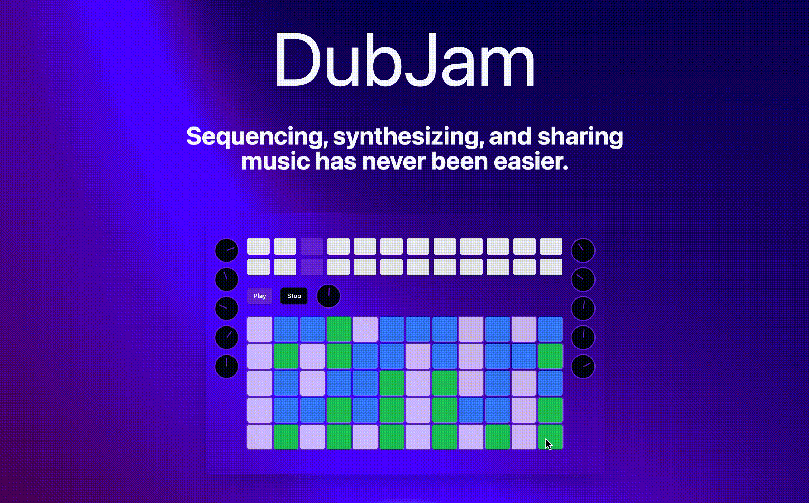

# DubJam

A collaborative music making platform that allows users to craft fun melodies and collaborate in real-time. DubJam is built using [React](https://reactjs.org/), [Tone.js](https://tonejs.github.io/), [Ably](https://www.ably.io/), and more!

This project was created for the 10th anniversary of [DubHacks](https://dubhacks.co/), the University of Washington's annual hackathon.
